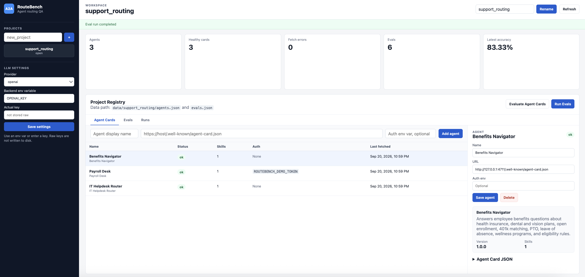
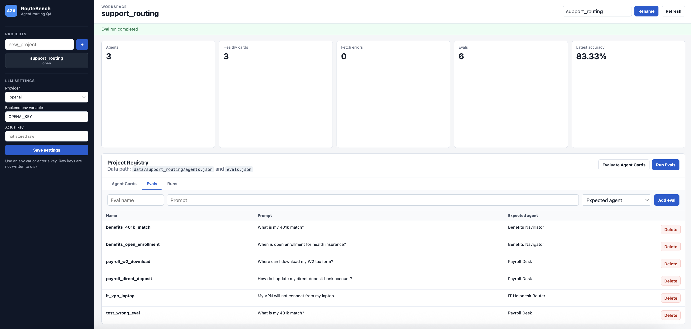
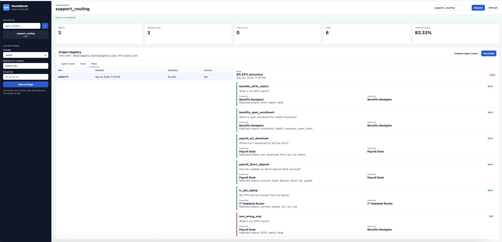

# A2A RouteBench

A2A RouteBench is a local-first web app for managing A2A Agent Card URLs, fetching and inspecting Agent Cards, and building routing eval sets.

The app has two parts:

- `backend/`: FastAPI API and file persistence.
- `frontend/`: TypeScript web UI.

All user-created data lives under `data/`, which is ignored by Git.

## Requirements

- Python 3.11+
- Node.js 20+
- npm

Install frontend dependencies:

```bash
npm --prefix frontend install
```

Install backend dependencies if your environment does not already have FastAPI and Uvicorn:

```bash
python3 -m pip install -r backend/requirements.txt
```

## Run The App

If you want to test with the included local sample Agent Cards, start them first:

```bash
npm run agents:up
```

This starts:

```text
http://127.0.0.1:4711/.well-known/agent-card.json  benefits-agent
http://127.0.0.1:4712/.well-known/agent-card.json  payroll-agent, auth required
http://127.0.0.1:4713/.well-known/agent-card.json  it-helpdesk-agent
```

The protected payroll card uses this token:

```bash
export ROUTEBENCH_DEMO_TOKEN=local-demo-token
```

Start the backend:

```bash
npm run backend
```

In another terminal, start the frontend:

```bash
npm run frontend
```

Open:

```text
http://127.0.0.1:5173
```

When you are done testing with the local sample Agent Cards, stop them:

```bash
npm run agents:down
```

## Screenshots

Agent Card registry and JSON inspection:



Eval authoring and expected-agent selection:



Run history and per-eval results:



## Data Layout

`data/` is the local app database and is ignored by Git.

```text
data/
  llm.config
  my_project/
    agents.json
    evals.json
```

Project names must be unique and use one word. Letters, numbers, and underscores are allowed.

## Projects

From the UI, create a project with a name such as:

```text
support_routing
```

The backend creates:

```text
data/support_routing/
  agents.json
  evals.json
```

You can rename the project from the UI. Renaming changes the project directory name under `data/`.

## Agents

For each agent, add:

- display name;
- Agent Card URL;
- optional auth environment variable name.

For the included local sample Agent Cards, use:

```text
Benefits Navigator  http://127.0.0.1:4711/.well-known/agent-card.json
Payroll Desk        http://127.0.0.1:4712/.well-known/agent-card.json  auth env: ROUTEBENCH_DEMO_TOKEN
IT Helpdesk Router  http://127.0.0.1:4713/.well-known/agent-card.json
```

Remember: the local sample Agent Cards are not part of the backend process. Bring them up with `npm run agents:up` before adding/evaluating those URLs, and bring them down with `npm run agents:down` when finished.

When an agent is added or edited, the backend fetches the Agent Card immediately. Agents are stored as an array in:

```text
data/<project_name>/agents.json
```

If `auth_env_name` is set, the backend reads that environment variable and sends it as:

```text
Authorization: Bearer <value>
```

Click **Evaluate Agent Cards** to refetch every Agent Card in the project. This updates `agents.json` and lets you inspect the latest Agent Card JSON, but it does not run prompt evals.

## Evals

Each eval has:

- name;
- prompt;
- expected agent.

The expected agent dropdown is populated from the agents in the current project.

Example evals for the included local sample agents:

| Name | Prompt | Expected Agent |
| --- | --- | --- |
| `benefits_401k_match` | `What is my 401k match?` | `Benefits Navigator` |
| `benefits_open_enrollment` | `When is open enrollment for health insurance?` | `Benefits Navigator` |
| `payroll_w2_download` | `Where can I download my W2 tax form?` | `Payroll Desk` |
| `payroll_direct_deposit` | `How do I update my direct deposit bank account?` | `Payroll Desk` |
| `it_vpn_laptop` | `My VPN will not connect from my laptop.` | `IT Helpdesk Router` |

Evals are stored as an array in:

```text
data/<project_name>/evals.json
```

## Runs And Results

Click **Run Evals** to execute the project evals against the fetched Agent Cards. The UI shows a **Runs** tab with:

- run timestamp;
- accuracy;
- correct/total count;
- pass/fail result for each eval;
- expected agent vs selected agent;
- the routing reason.

Runs are stored in:

```text
data/<project_name>/runs.json
```

## LLM Settings

The global settings page supports:

- Gemini;
- OpenAI;
- Anthropic;
- Grok.

Settings are stored in:

```text
data/llm.config
```

Raw API keys are not written to disk. If you enter a key, the backend only stores a masked preview. Prefer setting an environment variable and saving the variable name.

## API

The FastAPI server exposes project, agent, eval, and settings endpoints under:

```text
http://127.0.0.1:8000/api
```
